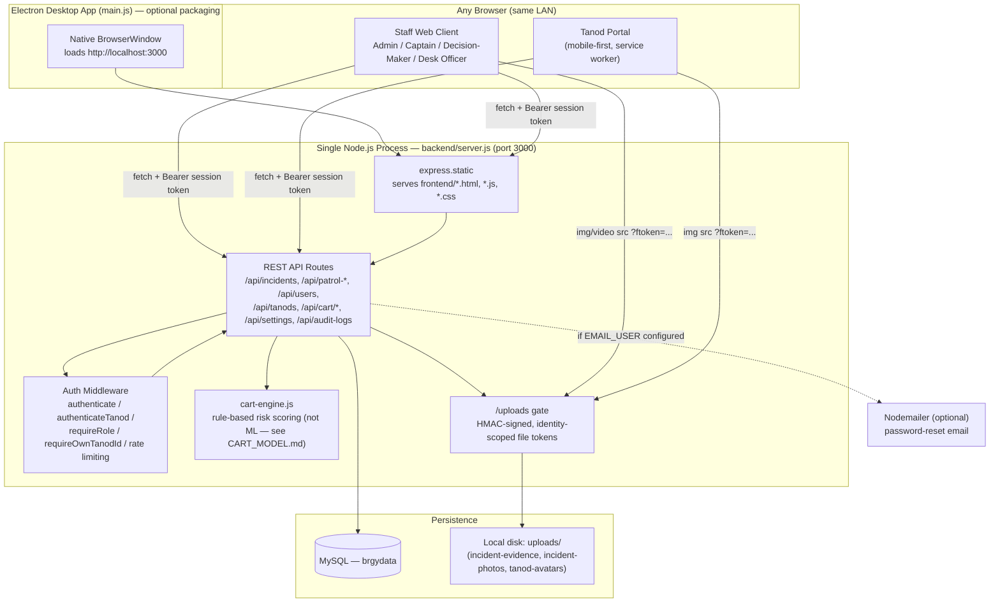

# System Architecture & Database Design

Reference diagrams for the thesis methodology chapter. Both are Mermaid diagrams —
GitHub renders them inline, and they can be exported to PNG/SVG via the
[Mermaid Live Editor](https://mermaid.live) (paste the code block, then Export) for
inclusion in the printed document.

## 1. System Architecture

Barangay 179 Crime BI is a **single Node.js process** (`backend/server.js`) that both
serves the static frontend and exposes the REST API — there is no separate frontend
server, and no separate backend deployment. The Electron shell (`main.js`) is purely
an optional desktop wrapper: it starts that same Express process in-process and opens
a native window pointed at `http://localhost:3000`. Any device on the same LAN can
instead reach it directly from a browser (see the Tanod Portal, used on-site by field
tanods).

**Key design points worth citing in the methodology chapter:**

- **Two independent auth systems**, not one shared login: staff accounts
  (`users` table, session tokens in `user_sessions`) and tanod field accounts
  (`tanod_record`, PIN-based, session tokens in `tanod_sessions`). Each has its own
  rate-limited lockout (`login_attempts` / `tanod_login_attempts`, 5 failed attempts
  per 15 minutes) layered under a generic IP-based rate limiter on every auth route.
- **Role-based access control** (`requireRole([...])` middleware) gates every route by
  the four staff roles (Administrator, Decision-Maker/Captain, Desk Officer) plus the
  separate tanod role — not per-resource ownership. A tanod's own session is further
  scoped to its own records (`requireOwnTanodId`), since tanods *do* have an ownership
  boundary staff roles don't.
- **File access is token-gated, not a bare static mount** — a 60-second HMAC-signed
  token (`issueFileToken`/`verifyFileToken`) is required on every `/uploads/*` request,
  and the token itself encodes whether it was issued to staff (unrestricted) or a
  specific tanod (restricted to that tanod's own avatar/photos only).
- **CART is a rule-based weighted scoring engine**, not a trained machine-learning
  model — see `docs/CART_MODEL.md` for the full rationale and `docs/FUTURE_WORK.md` for
  what training a real model against this would require.

## 2. Entity-Relationship Diagram

Generated directly from `database/schema.sql` (22 tables). Grouped by subsystem below
for readability, but this is one connected diagram — foreign keys cross the groups
(e.g. almost every table traces back to `users`).

```mermaid
erDiagram
    USERS {
        int id PK
        varchar name
        varchar username UK
        varchar password_hash
        enum role "Administrator | Decision-Maker | Desk Officer"
        varchar contact_no
        varchar email
        tinyint is_active
        timestamp last_login_at
    }

    USER_SESSIONS {
        int id PK
        int user_id FK
        varchar session_token UK
        timestamp login_time
        timestamp last_activity
        timestamp logout_time
        varchar ip_address
        tinyint is_active
    }

    LOGIN_ATTEMPTS {
        int id PK
        varchar username
        varchar ip_address
        timestamp attempt_time
        tinyint success
    }

    LOGIN_HISTORY {
        int id PK
        int user_id FK
        varchar username
        varchar ip_address
        datetime login_time
    }

    PASSWORD_RESETS {
        int id PK
        int user_id FK
        varchar reset_token UK
        timestamp expires_at
        timestamp used_at
    }

    AUDIT_LOGS {
        int id PK
        int user_id FK
        varchar action
        varchar entity_type
        int entity_id
        json old_data
        json new_data
        varchar ip_address
        timestamp created_at
    }

    SYSTEM_SETTINGS {
        int id PK
        varchar setting_key UK
        text setting_value
        int updated_by FK
    }

    INCIDENTS {
        int id PK
        varchar incident_type
        date date
        time time
        decimal latitude
        decimal longitude
        varchar street_name
        varchar address
        int reporter_id FK "nullable — staff who logged it"
        int reporter_tanod_id FK "nullable — tanod who logged it"
        varchar status "Open | Monitoring | Resolved"
        text description
        varchar danger_level
        varchar photo_path
        varchar blotter_number
        varchar reported_by_name "citizen/reporter, free text"
        varchar priority "Normal | Urgent"
    }

    INCIDENT_EVIDENCE {
        int id PK
        int incident_id FK
        varchar file_path
        enum file_type "image | video"
        varchar original_filename
    }

    CART_RISK_FACTORS {
        int id PK
        int incident_id FK "one row per incident, UNIQUE"
        decimal time_risk_score
        decimal day_risk_score
        decimal type_risk_score
        decimal location_risk_score
        decimal frequency_risk_score
        decimal total_risk_score
        varchar danger_level
        text decision_path
        varchar model_version
    }

    CART_ANALYSIS_LOG {
        int id PK
        varchar analysis_type "risk_prediction | simulation"
        date date_range_start
        date date_range_end
        int total_incidents_analyzed
        int high_risk_count
        int moderate_risk_count
        int low_risk_count
        int triggered_by FK
    }

    CART_DECISION_RULES {
        int id PK
        varchar rule_name
        text conditions
        varchar result_risk_level
        int created_by FK
        tinyint is_active
    }

    LOCATION_COORDINATES {
        varchar location PK
        decimal latitude
        decimal longitude
        int set_by FK
    }

    AREA_RISK_DECAY {
        varchar location PK
        decimal decay_amount
        timestamp updated_at
    }

    TANOD_TEAMS {
        int id PK
        varchar name UK
    }

    TANOD_RECORD {
        int id PK
        varchar name
        varchar position
        varchar profile_picture
        varchar contact_no
        tinyint is_active
        int user_id FK "nullable — linked staff account, if any"
        varchar username UK
        varchar pin_code_hash
        int team_id FK
    }

    TANOD_SESSIONS {
        int id PK
        int tanod_id FK
        varchar session_token UK
        timestamp login_time
        timestamp last_activity
        tinyint is_active
    }

    TANOD_LOGIN_ATTEMPTS {
        int id PK
        varchar username
        varchar ip_address
        timestamp attempt_time
        tinyint success
    }

    TANOD_AUDIT_LOGS {
        int id PK
        int tanod_id FK
        varchar action
        varchar entity_type
        int entity_id
        json new_data
    }

    PATROL_SCHEDULES {
        int id PK
        varchar location
        time start_time
        time end_time
        varchar day_of_week
        int assigned_tanods "denormalized count"
        text reason
        varchar status "Active | Completed"
        decimal latitude
        decimal longitude
    }

    PATROL_SCHEDULE_TANODS {
        int id PK
        int schedule_id FK
        int tanod_id FK
    }

    PATROL_LOGS {
        int id PK
        int schedule_id FK
        int tanod_id FK
        text report
        varchar status "Completed | Partial"
        date patrol_date
    }

    USERS ||--o{ USER_SESSIONS : "authenticates"
    USERS ||--o{ LOGIN_HISTORY : "logs in"
    USERS ||--o{ PASSWORD_RESETS : "requests"
    USERS ||--o{ AUDIT_LOGS : "performs actions"
    USERS ||--o{ SYSTEM_SETTINGS : "last updated by"
    USERS ||--o{ INCIDENTS : "reports (staff-logged)"
    USERS ||--o{ CART_ANALYSIS_LOG : "triggers"
    USERS ||--o{ CART_DECISION_RULES : "authors"
    USERS ||--o{ LOCATION_COORDINATES : "pins"
    USERS ||--o| TANOD_RECORD : "optionally linked staff account"

    INCIDENTS ||--o{ INCIDENT_EVIDENCE : "has attached"
    INCIDENTS ||--|| CART_RISK_FACTORS : "scored by"

    TANOD_TEAMS ||--o{ TANOD_RECORD : "groups"
    TANOD_RECORD ||--o{ TANOD_SESSIONS : "authenticates"
    TANOD_RECORD ||--o{ TANOD_AUDIT_LOGS : "performs actions"
    TANOD_RECORD ||--o{ INCIDENTS : "reports (field-logged)"
    TANOD_RECORD ||--o{ PATROL_SCHEDULE_TANODS : "assigned via"
    TANOD_RECORD ||--o{ PATROL_LOGS : "submits"

    PATROL_SCHEDULES ||--o{ PATROL_SCHEDULE_TANODS : "staffed by"
    PATROL_SCHEDULES ||--o{ PATROL_LOGS : "logged against"
```

`LOGIN_ATTEMPTS` and `TANOD_LOGIN_ATTEMPTS` are intentionally not linked by foreign
key — they key off `username` (text) specifically so a lockout record survives even
if the account is later deleted, and so a username can be rate-limited before the
system has even confirmed it belongs to a real account.

## Known gap

There is no `street_id` foreign key — `incidents.street_name`, `patrol_schedules.location`
and `location_coordinates.location` all key off the same free-text street name,
validated at the application layer against `backend/locationList.js` rather than a
proper lookup table. See `docs/FUTURE_WORK.md` for why this wasn't changed now.
